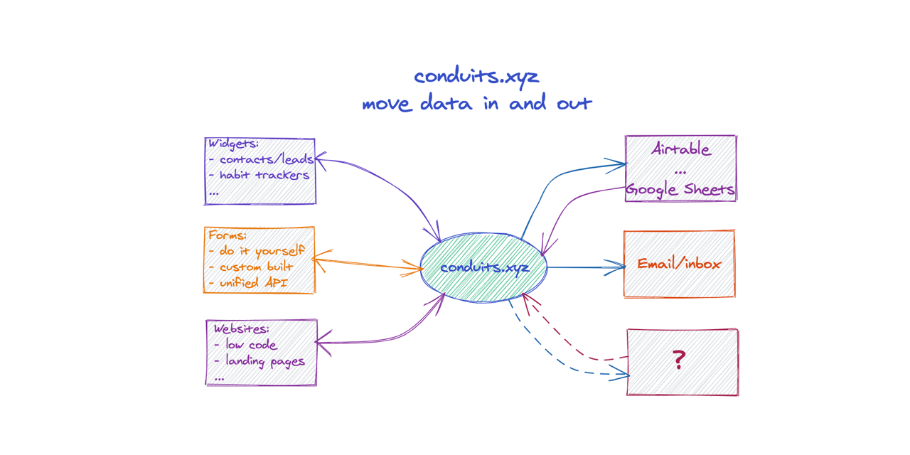

# Conduits XYZ

Spreadsheets and even email inboxes can be seen as a form of storage. Access to such storage using an API is complex due to diversity and broad use cases that have to be supported by the service provider or the protocol itself.

Having a `conduit` that exposes a simple API to these non-traditional storage (NTS) types could cover a majority of use cases of internet applications that require a database. And that precisely is what this project is all about.

Conduits.xyz is a gateway service that lets you move data in and out of spreadsheets and email inboxes by providing a uniform REST API. This allows you to focus on building your business, and access the data using programs that you already know.

# Use cases
1. A tech savvy digital marketer requires simple storage for a time bound campaign to capture interest list.
2. A blogger needs storage for a widget that captures reactions (thumbs-up, thumbs-down) from readers. 
3. An open source developer needs to store data persistently for an experimental single page app.

# Features
- Turn Google Sheets and Microsoft Excel and even your Email inbox into a database.
- Create conduits to access data using a uniform API.
- Simple web interface to manage conduits
- Access control to set read, write, update permisions per conduit
- Request throttling
- IP address allow-list to restrict access
- Hidden form field control to alleviate spam
- MIT License

# Development
Conduits service consists of three primary subsystems:
- Backend resource server to manage user and conduit data
- Backend gateway server to transform and forward conduit requests
- Dashboard user interface to administer user profile and conduits

Follow the links below to get started:
- [Dashboard](dashboard/README.md)  
- [Backend](backend/README.md)  
- [Widgets](examples/widget-gallery/README.md)  
- [Illustrative use case flows](examples/use-cases/contact-validation-flow/README.md)  

# Contribution

We are still in the design stage. When the project gets to a point where it is actually functional, we'll be happy to receive your pull request. Until then stay tuned!
