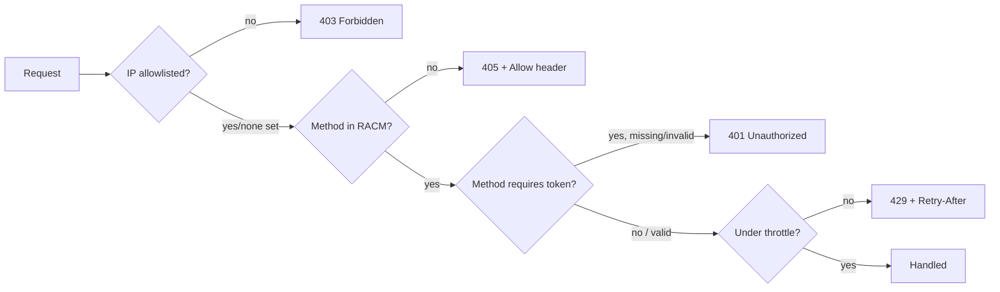

# Building on a conduit: a developer guide

For the full wire contract and rationale, see
[`docs/gateway-api.md`](gateway-api.md) — this guide doesn't restate
it, only what's needed to build against it quickly.
[`packages/conduit/INTEGRATIONS.md`](../packages/conduit/INTEGRATIONS.md)
covers the source-integration contract if you're adding a new backend.

**Vocabulary used throughout:** **curi** — a conduit's own public
identifier (the map key in `conduits.yaml`); a bare curi
(`contact-form`) and a full URL
(`https://your-gateway.example/api/contact-form`) are both valid
wherever this guide accepts a conduit URL. **RACM** — which HTTP
methods a conduit allows (`methods:` in YAML). **Allowlist** — the
optional IP restriction. **Schema** — `GET /api/:curi/schema`, the
field names/types a conduit's table has. **Field map** — the optional
widget-facing-name → real-column-name translation
(`fieldMap:` in YAML).

**Contents:** [Concepts](#concepts) ·
[Tutorial: your first widget](#tutorial-your-first-widget-end-to-end) ·
[How-to guides](#how-to-guides) · [Authentication](#authentication) ·
[Reference](#reference) · [Explanation](#explanation) ·
[Known limitations](#known-limitations)

## Concepts

Beyond the vocabulary above:

| Term | Meaning |
|:-----|:--------|
| **Wire envelope** | `{fields: {...}}` in, `{id, createdTime, fields: {...}}` out for a single record; a list is `{records: [...]}`. Keeps `id`/`createdTime` out of a record's own data namespace. |
| **curi resolution** | A bare curi (`XXXXXXXX`) and a full URL (`https://host/api/XXXXXXXX`) are both valid wherever this guide accepts a conduit URL, resolved against the calling page's own origin. |

## Tutorial: your first widget, end to end

**1. Get a conduit URL.** Define one in your gateway's `conduits.yaml`
(see [`services/gateway/README.md`](../services/gateway/README.md)) —
its map key is the curi — or ask whoever runs the gateway you're
building against for the URL.

**2. Confirm it's reachable before wiring anything up.**

```js
const ok = (await fetch(`${conduitUrl}/readyz`)).ok
```

```sh
curl -i "$CONDUIT_URL/readyz"   # 204 = reachable
```

`/readyz` needs no RACM, no token, and never touches the underlying
sheet — a failure here means the URL itself is wrong (or the conduit's
inactive), not a transient data-source problem. See
[Explanation](#explanation) for why it's a separate route.

**3. Write a record.**

```js
const response = await fetch(conduitUrl, {
  method: 'POST',
  headers: { 'Content-Type': 'application/json' },
  body: JSON.stringify({ fields: { name: 'Ada', email: 'ada@example.com' } }),
})
// 201 on success: { id, createdTime, fields }
```

```sh
curl -i -X POST "$CONDUIT_URL" \
  -H 'Content-Type: application/json' \
  -d '{"fields": {"name": "Ada", "email": "ada@example.com"}}'
```

**4. Read records back.**

```js
const { records } = await fetch(conduitUrl).then((r) => r.json())
```

```sh
curl -s "$CONDUIT_URL" | jq '.records'
```

**5. Handle the one write error every client should expect.** A field
name the sheet doesn't have gets a real, displayable `400` — show it
as-is rather than a generic failure:

```js
if (!response.ok && response.status < 500) {
  const { error } = await response.json()
  showError(error) // e.g. "Unknown field: 'valid'"
}
```

That's the whole loop `examples/basic-form/` and
`examples/basic-ajax-form/` demonstrate. `examples/contact-validation-flow/`
extends it to update-in-place and to three conduits with different
access levels against the same sheet.

## How-to guides

### Wire up a pre-built widget

Every widget in `packages/widgets/` is a zero-dependency custom element reading
its conduit from an attribute:

```html
<script src="xyz-waitlist.js"></script>
<xyz-waitlist conduit-url="https://your-domain/api/XXXXXXXX"></xyz-waitlist>
```

Copy the file, drop it next to your page, done. Read the widget's own
file for its exact wire format; each one documents it in a header
comment. Attributes: see [Reference](#reference) below.

Testing against your own locally running gateway (`npm run gateway` in
`services/gateway`, default port `8787`)? `conduit-url` is just
`{origin}/api/{curi}` — point it at
`http://localhost:8787/api/your-curi`, no different from any other
origin.

### Accept a bare curi, not just a full URL

Reuse the resolution pattern in `examples/conduit-url-input.js` rather
than re-deriving it — it also handles a page opened via `file://` (no
origin to resolve a bare curi against) and an optional
`localStorage`-backed "remember the last working value" behavior.

### Handle a schema mismatch without a confusing failure

Show the server's own message plus the actionable fix — this is the
one write failure with a real fix on the conduit owner's side, not
something a client can work around (see
[Explanation](#explanation)):

```js
if (response.status === 400) {
  const { error } = await response.json()
  showBanner(`${error} — ask the conduit owner to add this column under Data source → Change → Schema → + Add field.`)
}
```

### Pace bulk or looped requests

A conduit throttles at 5 requests/second by default, returning
`Retry-After: 1` on a `429`. A script firing writes back-to-back will
hit that well before a human would:

```js
for (const record of records) {
  await write(record)
  await sleep(220) // stays under 5 req/sec with margin
}
```

Prefer the API's own bulk shape where you can — a single
`POST {records: [...]}` (capped at 10) counts as one request against
the throttle, not one per record.

### Treat an unset field as falsy, not `null`

A cell that's never been written comes back from a real Google Sheet
as `''`, never `null`/`undefined`:

```js
const isUnprocessed = (record) => !record.fields.status // catches '', null, and undefined alike
```

A check that only matches `null` passes against seeded test data but
misses the real, empty-string case a live sheet actually returns.

### Redirect after a plain HTML-form submission

Add a hidden `_redirect` field naming a same-origin path and a
successful, non-fetch submission redirects there instead of showing
the raw JSON response:

```html
<form method="POST" action="https://your-domain/api/XXXXXXXX">
  <input type="hidden" name="_redirect" value="/thanks">
</form>
```

Omit it (or submit via `fetch`) to handle the JSON response yourself.

### Test before you go live

Run through `examples/widget-gallery/` against a scratch sheet before
pointing real traffic at a conduit: submit a field the sheet doesn't
have yet (confirm you get the `400` from the how-to above, not a
silent auto-add), and fire a quick burst of requests to confirm the
`429`/`Retry-After` path actually triggers rather than assuming the
default throttle is on.

## Authentication

```
Authorization: Bearer <token>
```

```sh
curl "$CONDUIT_URL" -H "Authorization: Bearer $TOKEN"
```

Regenerating a token invalidates the old one immediately — a caller
still using it gets `401` on its very next request, no grace period.
`GET /api/:curi/schema` always requires a token, even for a conduit
with no method marked token-required at all. Token generation,
hashing, and the fail-closed behavior when no token has ever been
issued are covered in
[`docs/gateway-api.md`](gateway-api.md#bearer-token).

## Reference

### Routes

| Route | Extra auth | Success | Notes |
|:------|:-----------|:--------|:------|
| `GET /api/:curi` | — | `200 {records, nextCursor}` | `?cursor=`/`?limit=` |
| `POST /api/:curi` | — | `201` | single `{fields}` or bulk `{records: [...]}` (max 10), decided by shape |
| `GET/PUT/PATCH/DELETE /api/:curi/:id` | — | `200` / `200 {id, deleted: true}` | body must not also carry `id` |
| `PUT/PATCH/DELETE /api/:curi` (bulk) | — | `200 {records}` | atomic — one bad id/field fails the whole batch |
| `GET /api/:curi/readyz` | none at all | `204` | see [Tutorial](#tutorial-your-first-widget-end-to-end) step 2 |
| `GET /api/:curi/schema` | token, always | `200 {fields: [...]}` | field names under their widget-facing names if a field map is set |
| `OPTIONS /api/:curi[/:id]` | — | `204` | CORS preflight, no conduit lookup |

Full request/response shapes: [`docs/gateway-api.md`](gateway-api.md#routes).

### Status codes

| Status | Meaning | Where |
|:-------|:--------|:------|
| `200`/`201` | Success | every route |
| `204` | No content | `/readyz` reachable; `OPTIONS` preflight |
| `400` | Malformed body, duplicate/too-many ids, `id` supplied on create, or `Unknown field: '<name>'` | every write route |
| `401` | Missing/invalid bearer token | any token-required method; always on `/schema` |
| `403` | Caller's IP isn't allowlisted | every route but `OPTIONS` |
| `404` | Unknown/inactive curi, or (bulk/single writes) an id that doesn't resolve | every route |
| `405` | Method not in this conduit's RACM (`Allow` header lists what is) | every RACM-gated route |
| `429` | Over *this conduit's own* throttle limit (`Retry-After: 1`) | every throttled route |
| `502` | Source unreachable, or returned an unexpected error — including Google's own rate limit, a different thing from `429` (see [Explanation](#explanation)) | any route touching the source |

### Custom element attributes

| Widget | Required | Optional |
|:-------|:----------|:---------|
| `<xyz-waitlist>` | `conduit-url` | — |
| `<xyz-reactions>` | `conduit-url` | `subject` (groups reactions when one conduit backs more than one thing being reacted to) |

## Explanation

### Why a write can be rejected for a field that "obviously" should work

A conduit's write endpoint is public, so field names are only ever
accepted, never silently added — full rationale in
[`docs/gateway-api.md`](gateway-api.md#record-shape). For a client,
the practical consequence is: this `400` is never worth retrying, and
never a client-side bug — the fix is always on the conduit owner's
side (add the column), which is why it's worth its own error message
rather than folding it into a generic failure handler.

### Why allowlist, RACM, and the bearer token are checked in that order

<!-- Mirrors packages/gateway/pipeline.ts's createGatewayMiddleware()
     array — update this if that array's order changes. -->


Each layer only ever narrows what the layer before it already allowed,
and a caller only ever learns as much as the first layer it fails
tells it — a non-allowlisted caller never learns which methods or
token rules this conduit even has configured. Branch client-side error
handling on this order: a `403` means the client's own network/IP is
the problem, not its request shape.

### Why a `429` and a `502` aren't the same kind of limit

A conduit's `throttle` and Google's own Sheets API quota are two
independent things that happen to both be "a rate limit," enforced by
two different parties:

- **The conduit's own throttle** (5 requests/second, on by default) is
  this gateway protecting *its own* public URL from abuse. It's the
  only one you can see or configure — the `throttle` field in
  `conduits.yaml` — and the only one reported as `429`.
- **Google's own per-project quota** on Sheets API calls is external:
  nothing in this repo sets it, exposes a number for it, or gets
  warned before hitting it. Bulk writes are batched into one Sheets API call
  per request specifically to keep well clear of it, not to respect a
  documented limit — see
  [`packages/conduit/sheets.ts`](../packages/conduit/sheets.ts)'s own
  notes on batching. If it's ever hit anyway, the conduit's caller
  gets the same `502` any other Sheets-side failure produces — never
  a `429`.

The practical implication: not seeing `429`s doesn't mean a client is
safe from rate-limit-shaped failures under load — a burst of many
small, non-bulk writes could still surface as an occasional `502`,
which is Google's quota, not this gateway's throttle, and isn't fixed
by pacing against the `Retry-After` header the way a `429` is (there's
no equivalent signal to pace against; using the API's own bulk shape,
per the [pacing how-to](#pace-bulk-or-looped-requests), is the actual
mitigation).

## Known limitations

- **No idempotency key.** A retried `POST` after a dropped or timed-out
  response can create a duplicate row — dedupe client-side (e.g. a
  disabled submit button) if that matters for your use case.
- **No compare-and-swap** on concurrent writes to the same row — see
  [`docs/gateway-api.md`](gateway-api.md#record-shape) for what that
  means in practice.
- **Throttle state is per-process and in-memory** — it resets on
  restart and doesn't coordinate across multiple server processes.
