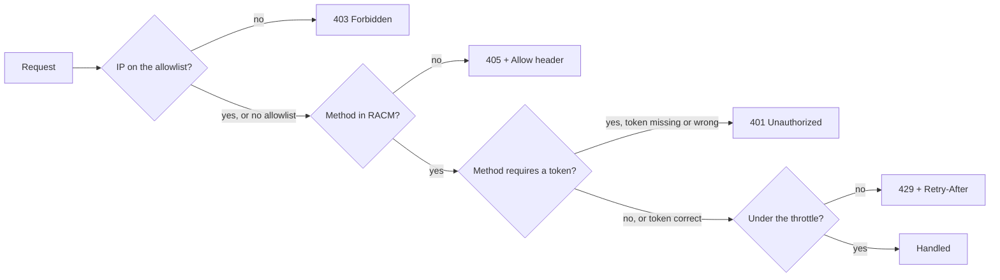

# Developer guide

This guide shows how to call a conduit from a web page or a script.
For every rule of the wire API, read
[`docs/gateway-api.md`](gateway-api.md). To add a new data source, read
[`packages/conduit/INTEGRATIONS.md`](../packages/conduit/INTEGRATIONS.md).

**Contents:** [Words used](#words-used) ·
[Safe defaults](#safe-defaults) · [Tutorial](#tutorial-your-first-widget) ·
[How-to guides](#how-to-guides) · [Authentication](#authentication) ·
[Reference](#reference) · [Explanation](#explanation) ·
[Known limitations](#known-limitations)

## Words used

| Word | Meaning |
|:--|:--|
| **Conduit** | One API endpoint for one data source, for example one tab of a Google Sheet. |
| **CURI** | The permanent name of a conduit, for example `contact-form`. It is the `curi:` field in `conduits.yaml`. It is not a URL. |
| **Route** | The path where a gateway serves a conduit. The default is `/<curi>`. This guide writes `<route>`. |
| **Conduit URL** | The gateway origin and the route, for example `https://gateway.example/contact-form`. |
| **Record** | One row. It goes in as `{fields}` and comes out as `{id, createdTime, fields}`. |
| **RACM** | The HTTP methods that a conduit allows (`methods:` in YAML). |
| **Allowlist** | The IP addresses that can call a conduit. It is optional. |
| **Bearer token** | A secret that the methods you choose require. |
| **Field map** | Optional names for fields, different from the column names in the source (`fieldMap:` in YAML). |

## Safe defaults

Do these things in every client:

1. Send each request through one function that handles `429`, `503`,
   and errors. Copy [`conduitFetch`](#call-a-conduit).
2. Check `GET <route>/.conduits/readyz` before you show a widget.
3. Send a record as `{fields: {...}}`. Do not send an `id` when you create a record.
4. Decide what to do from the error's `code`, not from its text. See [Error codes](#error-codes).
5. On `rate_limited` (`429`) or `source_busy` (`503`), wait `retryAfter` seconds. Then retry. The gateway did not do the request, so a retry is safe for each method.
6. Do not retry a `POST` after a network error, a timeout, or another `5xx`. The record can exist already.
7. Write many records with one bulk request (10 records or fewer), not a loop of single writes.
8. To read all records, follow `nextCursor` until it is `null`. Do not make or change a cursor.
9. Treat `''` as an empty value. Google Sheets returns `''` for an empty cell, not `null`.

> **WARNING:** Do not put a bearer token in a public web page. Anyone
> can read it there. Use bearer tokens only in server code or in
> private tools.

## Tutorial: your first widget

1. Get a conduit URL. Add a conduit to your gateway's `conduits.yaml`
   (see [`services/gateway/README.md`](../services/gateway/README.md)),
   or ask the operator of the gateway for the URL.

2. Make sure that the conduit is available:

   ```js
   const ok = (await fetch(`${conduitUrl}/.conduits/readyz`)).ok
   ```

   ```sh
   curl -i "$CONDUIT_URL/.conduits/readyz"   # 204 = available
   ```

   This route needs no RACM and no bearer token, and it does not read
   the source. A failure means that the URL is wrong or the conduit is
   inactive.

3. Write a record:

   ```js
   const response = await fetch(conduitUrl, {
     method: 'POST',
     headers: { 'Content-Type': 'application/json' },
     body: JSON.stringify({ fields: { name: 'Ada', email: 'ada@example.com' } }),
   })
   // 201: { id, createdTime, fields }
   ```

   ```sh
   curl -i -X POST "$CONDUIT_URL" \
     -H 'Content-Type: application/json' \
     -d '{"fields": {"name": "Ada", "email": "ada@example.com"}}'
   ```

4. Read the records. A read returns one page. For all pages, see
   [Read all records](#read-all-records).

   ```js
   const { records, nextCursor } = await fetch(conduitUrl).then((r) => r.json())
   ```

   ```sh
   curl -s "$CONDUIT_URL" | jq '.records'
   ```

5. Handle an error. Each error is RFC 9457 Problem Details with a
   stable `code` (see [Error codes](#error-codes)). An unknown field
   gets `unknown_field`, and `errors` names each field:

   ```js
   if (!response.ok) {
     const problem = await response.json()
     if (problem.code === 'unknown_field') {
       for (const { field } of problem.errors) markField(field, 'The sheet has no column for this field.')
     }
   }
   ```

   In your own code, use [`conduitFetch`](#call-a-conduit). It retries
   a `429` and a `503` and throws the other errors.

`library/pages/progressive-enhancement-form/` shows these steps with a
plain HTML form and with `fetch`. `library/pages/contact-validation-flow/`
also updates records, and uses three conduits with different access on
one sheet.

## How-to guides

### Call a conduit

Copy this function, and send each request through it:

```js
// An error from a conduit: the gateway's problem details
// (status, code, title, detail, errors, retryAfter).
class ConduitError extends Error {
  constructor(problem) {
    super(problem.detail || problem.title)
    Object.assign(this, problem)
  }
}

// Sends a request to a conduit. On rate_limited (429) or source_busy
// (503), it waits retryAfter seconds and tries again, up to 5 times.
// On any other error, it throws a ConduitError.
async function conduitFetch(url, init = {}, attempts = 5) {
  for (let attempt = 1; ; attempt++) {
    const response = await fetch(url, init)
    if (response.ok) return response
    // A proxy in front of the gateway can send a body that is not JSON.
    const problem = await response.json().catch(() => ({ status: response.status, title: response.statusText }))
    const retry = problem.code === 'rate_limited' || problem.code === 'source_busy'
    if (retry && attempt < attempts) {
      await new Promise((resolve) => setTimeout(resolve, (problem.retryAfter ?? 1) * 1000))
      continue
    }
    throw new ConduitError(problem)
  }
}
```

Use it like `fetch`:

```js
try {
  const response = await conduitFetch(conduitUrl, {
    method: 'POST',
    headers: { 'Content-Type': 'application/json' },
    body: JSON.stringify({ fields: { name: 'Ada' } }),
  })
  const record = await response.json()
} catch (err) {
  if (err.code === 'unknown_field') {
    for (const { field } of err.errors) markField(field, 'The sheet has no column for this field.')
  } else {
    showError('Something went wrong. Please try again.')
  }
}
```

- A retry after `429` or `503` `source_busy` is safe for each method,
  also `POST`. The gateway did not do the request.
- The function does not retry a network error. For a `POST`, the
  record can exist already. Show an error, and let the user decide.

### Add a widget to a page

Each widget in `library/widgets/` is a custom element with no
dependencies. It reads its conduit URL from an attribute.

1. Copy the widget's directory next to your page.
2. Put the stylesheet in `<head>`, and the script and the element in
   `<body>`:

   ```html
   <link rel="stylesheet" href="xyz-waitlist/style.css">
   ```

   ```html
   <script src="xyz-waitlist/xyz-waitlist.js"></script>
   <xyz-waitlist conduit-url="https://gateway.example/XXXXXXXX"></xyz-waitlist>
   ```

Each widget's README lists its attributes and the columns that its
conduit needs. Widgets handle `429`, `503`, and errors themselves.

To test with a gateway on your computer, set `conduit-url` to
`http://localhost:8787/<curi>`. The gateway uses port `8787` by default.

### Accept a CURI as well as a full URL

Use `library/widgets/conduit-url-input.js`. Do not write your own
resolution. It resolves a CURI against the page origin. It also
handles a page opened from `file://`, which has no origin.

### Show an unknown-field error

The conduit owner must add the column to the source. The client cannot
correct this error. Mark each field, and tell the user who can correct
it:

```js
try {
  await conduitFetch(conduitUrl, request)
} catch (err) {
  if (err.code !== 'unknown_field') throw err
  for (const { field } of err.errors) markField(field, 'The sheet has no column for this field.')
  showBanner('Ask the conduit owner to add the marked columns to the sheet.')
}
```

In a bulk request, each item's `pointer` also gives the record, for
example `/records/2/fields/email`.

### Write many records

Use one bulk request for 10 records or fewer:

```js
await conduitFetch(conduitUrl, {
  method: 'POST',
  headers: { 'Content-Type': 'application/json' },
  body: JSON.stringify({ records: [{ fields: { name: 'Ada' } }, { fields: { name: 'Grace' } }] }),
})
```

A bulk request counts as one request for the throttle. For Google
Sheets, it uses as many calls to Google as one record does. If you must write records one
at a time, pace the requests. The throttle allows 5 requests each
second for each conduit:

```js
for (const record of records) {
  await write(record)
  await sleep(220) // fewer than 5 requests each second
}
```

### Read all records

A read returns one page. Follow `nextCursor` until it is `null`. Send
the cursor back without changes:

```js
async function readAll(conduitUrl) {
  const records = []
  let cursor = null
  do {
    const url = new URL(conduitUrl)
    if (cursor) url.searchParams.set('cursor', cursor)
    const body = await (await conduitFetch(url)).json()
    records.push(...body.records)
    cursor = body.nextCursor
  } while (cursor)
  return records
}
```

`?limit=` sets the page size. It must be a positive whole number and
not more than the gateway's maximum. Without `limit`, the gateway uses
its default. For the rules, see
[`docs/gateway-api.md`](gateway-api.md#list-reads).

### Check for an empty field

Google Sheets returns `''` for a cell that has no value. It does not
return `null` or `undefined`. Use a check that catches all three:

```js
const isUnprocessed = (record) => !record.fields.status
```

A check for `null` only passes with test data, but fails with a real
sheet.

### Go to a page after an HTML form submission

Add a hidden `_redirect` field with a path on your site. After a
successful submission, the gateway sends the browser to that path
(`303`):

```html
<form method="POST" action="https://gateway.example/XXXXXXXX">
  <input type="hidden" name="_redirect" value="/thanks">
</form>
```

These rules apply:

- The gateway uses the page's `Referer` header to find your origin.
  Without a `Referer`, the gateway returns JSON.
- The path must be on the same origin as the form's page. The gateway
  ignores any other value.
- The gateway never stores `_redirect`.
- It works only when you create one record.

### Test before you go live

Use a test sheet. Do these checks before real users can reach the
conduit:

1. Send a field that the sheet does not have. Make sure that you get
   the `400`.
2. Send more than 5 requests in one second. Make sure that you get a
   `429` with `Retry-After`.
3. Read a sheet with more records than one page. Make sure that your
   client gets all of them.

## Authentication

Send the bearer token in the `Authorization` header:

```
Authorization: Bearer <token>
```

```sh
curl "$CONDUIT_URL" -H "Authorization: Bearer $TOKEN"
```

- When the operator replaces a token, the old token stops at once. The
  next request with it gets `401`.
- `GET <route>/.conduits/schema` always requires a token.
- For token storage and the rules when no token exists, see
  [`docs/gateway-api.md`](gateway-api.md#bearer-token).

## Reference

### Routes

`<route>` is the path where the gateway serves the conduit. The
default is `/<curi>`, with no `/api` prefix.

| Route | Extra auth | Success | Notes |
|:--|:--|:--|:--|
| `GET <route>` | none | `200 {records, nextCursor}` | One page. `?limit=`, `?cursor=`. See [Read all records](#read-all-records). |
| `POST <route>` | none | `201` | One record `{fields}`, or 10 or fewer as `{records: [...]}`. |
| `GET/PUT/PATCH/DELETE <route>/:id` | none | `200`; `DELETE`: `200 {id, deleted: true}` | Do not put an `id` in the body. |
| `PUT/PATCH/DELETE <route>` | none | `200 {records}` | Bulk. One bad id or field stops the full request. |
| `GET <route>/.conduits/readyz` | none, and no RACM | `204` | Does not read the source. |
| `GET <route>/.conduits/schema` | token, always | `200 {fields: [...]}` | Uses the field map names. |
| `OPTIONS <route>`, `OPTIONS <route>/:id`, `OPTIONS <route>/.conduits/schema` | none | `204` | CORS preflight. |

For each request and response body, see
[`docs/gateway-api.md`](gateway-api.md#routes).

### Success statuses

| Status | Meaning | Routes |
|:--|:--|:--|
| `200`, `201` | Success. | All |
| `204` | Success, no body. | `.conduits/readyz`, `OPTIONS` |
| `303` | Go to the `_redirect` path. | `POST <route>` with `_redirect` |

### Error codes

Each error is RFC 9457 Problem Details (`application/problem+json`)
with a stable `code`. Use `code`, not the text, to decide what to do.
For each code, its status, and what your client does, see
[`docs/gateway-api.md`](gateway-api.md#codes).

## Explanation

### Why the gateway does not add a field

A conduit is public. If the gateway added each new field name, any
caller could add columns to your sheet. So the gateway refuses an
unknown field with `400`. A retry cannot succeed. Only the conduit
owner can add the column. For the full rule, see
[`docs/gateway-api.md`](gateway-api.md#record-shape).

### The order of the checks

<!-- Mirrors packages/gateway/pipeline.ts's createGatewayMiddleware()
     array. Update this when that order changes. -->

```mermaid
flowchart LR
    A[Request] --> B{IP on the allowlist?}
    B -- no --> R1[403 Forbidden]
    B -- yes, or no allowlist --> C{Method in RACM?}
    C -- no --> R2[405 + Allow header]
    C -- yes --> D{Method requires a token?}
    D -- yes, token missing or wrong --> R3[401 Unauthorized]
    D -- no, or token correct --> E{Under the throttle?}
    E -- no --> R4[429 + Retry-After]
    E -- yes --> F[Handled]
```

A caller learns only the result of the first check that fails. For
example, a caller that is not on the allowlist cannot see the RACM. A
`403` means that the problem is the caller's network, not the request.

### Two limits: 429 and 503

Two different limits can refuse a request. Both send `retryAfter` and
the `Retry-After` header.

| Limit | Status and code | What it protects | `Retry-After` |
|:--|:--|:--|:--|
| The conduit's throttle | `429` `rate_limited` | The conduit's URL. 5 requests each second. On by default (`throttle` in `conduits.yaml`). | Always `1`. |
| The gateway's Google Sheets budget | `503` `source_busy` | Google's Sheets quota, which all conduits on the gateway share. The operator sets it (`CONDUITS_SHEETS_REQUESTS_PER_MINUTE`, `CONDUITS_SHEETS_REQUESTS_PER_MINUTE_PER_ACCOUNT`). | Seconds until a request in the last minute stops counting. |

A `429` means that this caller sent too many requests. A `503` means
that the source is busy: other callers can use up the budget, so it is
not this caller's fault. If Google refuses a request anyway, the gateway
returns `503` `source_busy` with `Retry-After: 60`. Google's quota
refills each minute.

Your client does the same thing for each: it waits, then retries. To
use less of the budget, use bulk writes.

## Known limitations

- **No idempotency key.** A retried `POST` can create a second record.
  To prevent duplicates, for example, disable the submit button after
  the first click.
- **No protection for concurrent writes.** When two writes change the
  same row at the same time, the last write wins. See
  [`docs/gateway-api.md`](gateway-api.md#record-shape).
- **Paging is by position.** A row added or deleted while you read the
  pages can make one record appear twice or not at all.
- **The throttle is local to one process.** It resets when the gateway
  restarts. Two gateway processes do not share it.
